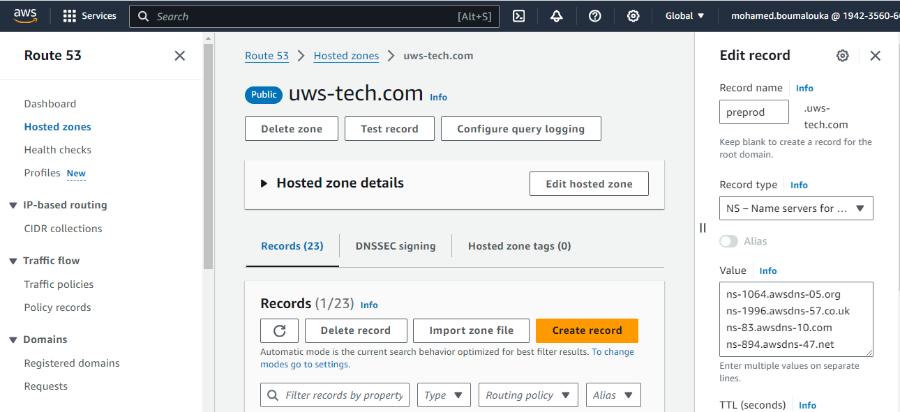

# Terraform Infrastructure as Code
This repository contains Terraform configurations for provisioning and managing infrastructure resources across multiple environments (e.g., staging, production) using a modular approach. Before using Terraform templates, we need to provision AWS Account.

# Provision New AWS Account
1. Create an IAM user (for example: `cicd-user`) that will be used by terraform to deploy in AWS account. The user must have enought rights to create AWS resources.
2. Create Access Key and Secret Access for the IAM user.
3. Create route53 hosted zone for the subdomain (for example: `preprod.uws-tech.com`).
4. In order to delegating from root to child HostedZones, in aws management account, within the root HostedZone `uws-tech.com`, create a new `NS` record whose key ("Record name") is the subdomain `preprod.uws-tech.com` and whose value is that which you noted down in the previous section. 
<p align="center"></p>

5. In aws certificate Manager, create a wildcard certificate (for example: `*.preprod.uws-tech.com`) and add a CNAME record in route53 HostedZone.
6. If you have never launched a Spot Fleet, the AWSServiceRoleForEC2SpotFleet Service-Linked Role won’t exist in the account. we need to create the service linked role to avoid the **ServiceLinkedRoleCreationNotPermitted** error. To create it run the following command:
```
aws iam create-service-linked-role --aws-service-name spot.amazonaws.com || true
```

7. Provision a terraform backend (see below).
8. Develop Terraform Templates.
9. Add secrets Variables in jenkins credential as secret text.
10. Create a Jenkinsfile (for example: `Jenkinsfile-preprod`) that will execute a terraform code in Jenkins.
11. Create a Jenkins Pipeline (for example: `Deploy-Infra-Preprod`) that will execute a jenkinsfile.

# Project structure 
The project follows a modular structure to promote reusability and maintainability:
```
terraform/
- environments/
  - preprod/
    - main.tf
    - resource1.tf
    - resource2.tf
    - ....
    - resourceN.tf
    - provider.tf
    - variables.tf
    - terraform.tfvars
  - prod/
    - main.tf
    - resource1.tf
    - resource2.tf
    - ....
    - resourceN.tf
    - provider.tf
    - variables.tf
    - terraform.tfvars
  - staging/
    - main.tf
    - resource1.tf
    - resource2.tf
    - ....
    - resourceN.tf
    - provider.tf
    - variables.tf
    - terraform.tfvars
- modules/
  - networking/
  - tools/
  - computing/
  - data/
  - iam/
  - s3/
```
- The environments directory contains separate subdirectories for each environment (e.g., preprod, prod), where environment-specific configurations are defined.

- The modules directory houses reusable Terraform modules that can be shared across environments.

# Prerequisites
- Terraform installed

- AWS CLI installed and configured with appropriate credentials

- Access to an AWS S3 bucket for storing Terraform state files

- Access to an AWS DynamoDB table for state locking

# Backends
This project uses AWS S3 and DynamoDB for storing Terraform state files and state locking, respectively. The backend configuration is defined in the **main.tf** file of each environment directory.
1. Create a DynamoDB table (for exemple: `terraform_lock_table` in preprod aws account )
   - See [AWS Docs](https://docs.aws.amazon.com/amazondynamodb/latest/developerguide/getting-started-step-1.html)
   - Set the column name (Partition Key) as `LockID` (String)
2. Create an S3 bucket (for exemple: `terraform-backend-uex-preprod` in preprod aws account )
   - Enable bucket versioning
   - Enable encryption
3. Include the backend block in the Terraform configuration
   - Specify the bucket name created in Step 2.
   - Specify the key attribute, which helps us create the state file with the same name as the provided value.
   - Specify the DynamoDB table created in Step 2
```
terraform {
   backend "s3" {
    bucket = "terraform-backend-uex-preprod"
    key    = "state/preprod.tfstate"
    region = "ap-southeast-1"
    encrypt = true
    dynamodb_table = "terraform_lock_table"
  } 
}
```
# Modules
Reusable Terraform modules are stored in the **modules** directory. Each module should have a **main.tf** file defining the resources, a **variables.tf** file for input variables, and an **outputs.tf** file for output values.

# Terraform initialisation  

For each environment, we can use this command to initialise terraform (prod environment as sample):

    export AWS_ACCESS_KEY_ID="xxxxxxxxx"
    export AWS_SECRET_ACCESS_KEY="xxxxxxxxxx"
    terraform -chdir=environments/prod init

# Import, create and delete resources via Terraform

## Import resources
To import the resources to be managed by the state file, we have to run this command (prod environment as sample):
```
export AWS_ACCESS_KEY_ID="xxxxxxxxx"
export AWS_SECRET_ACCESS_KEY="xxxxxxxxxx"
terraform -chdir=environments/prod import $RESOURCE_ADDRESS $RESOURCE_ID
```
```
SAMPLE (S3 bucket):
--> terraform -chdir=environments/prod import aws_cloudfront_origin_access_identity.oai E349FFLPDE2H8
--> terraform -chdir=environments/prod import module.bucket-claims_april_asia.aws_s3_bucket.bucket claims.april.asia
--> terraform -chdir=environments/prod import module.bucket-claims_april_asia.aws_s3_bucket_policy.bucketpolicy claims.april.asia
--> terraform -chdir=environments/prod import module.bucket-claims_april_asia.aws_s3_bucket_server_side_encryption_configuration.encryption claims.april.asia
--> terraform -chdir=environments/prod import module.bucket-claims_april_asia.aws_s3_bucket_versioning.versioning claims.april.asia
```
```
SAMPLE (CloudFront Distribution)
--> terraform -chdir=environments/prod import module.CFD-bucket-claims_april_asia.aws_cloudfront_distribution.s3_distribution EXK70BIMZWN0M
```
```
SAMPLE (IAM ROLE)
--> terraform -chdir=environments/prod import module.iam_role_access_cloudfront_website.aws_iam_role.iam_role access-cloudfront-website
```
```
SAMPLE (Lambda function)
--> terraform -chdir=environments/prod import module.lambda-MyAprilRedirectionPython.aws_lambda_function.function MyAprilRedirectionPython
```
```
SAMPLE (Aurora Cluster)
--> terraform -chdir=environments/prod import module.octnis-prod-rds-eu.aws_rds_cluster.dbcluster octnis-production
```
```
SAMPLE (Aurora Writer Instance)
--> terraform -chdir=environments/prod import module.octnis-prod-rds-eu.aws_rds_cluster_instance.writer octnis-production-instance-1
```
```
SAMPLE (Aurora Reader Instance)
--> terraform -chdir=environments/prod import module.octnis-prod-rds-eu.aws_rds_cluster_instance.reader[0] octnis-production-instance-1-eu-west-3c
```
```
SAMPLE (Security Group)
--> terraform -chdir=environments/prod import module.SG-Bastion.aws_security_group.SG sg-0e5dcee06687de109
```
```
SAMPLE (VPC)
--> terraform -chdir=environments/prod import module.vpc-Baymax-asia.aws_vpc.main-vpc vpc-edf8548a
```
```
SAMPLE (Subnet ID)
--> terraform -chdir=environments/prod import 'module.vpc-Baymax-asia.aws_subnet.public_subnet["pub-baymax-preprod-1b"]' subnet-043b5b49945169086
--> terraform -chdir=environments/prod import 'module.vpc-Baymax-asia.aws_subnet.private_subnet["priv-baymax-preprod-1b"]' subnet-40403b27
```
```
SAMPLE (Internet GW)
--> terraform -chdir=environments/prod import module.vpc-Baymax-asia.aws_internet_gateway.ig  igw-8e78fcea
```
```
SAMPLE ( AWS Route)
-- > terraform -chdir=environments/prod import module.vpc-Baymax-asia.aws_vpc.aws_route.public_internet_gateway rtb-01e8facbeb426215c_0.0.0.0/0
```
```
SAMPLE (Route Table)
--> terraform -chdir=environments/prod import module.vpc-Baymax-asia.aws_route_table.private rtb-083cd5b99beb10032
```
```
SAMPLE (Route Table Association)
--> terraform -chdir=environments/prod import 'module.vpc-Baymax-asia.aws_route_table_association.private["priv-baymax-preprod-1b"]' subnet-40403b27/rtb-083cd5b99beb10032
```
```
SAMPLE (NACL)
--> terraform -chdir=environments/prod import module.Admin-NACL.aws_default_network_acl.main acl-099c22b3e609aacfc
--> terraform -chdir=environments/prod import module.Bastion-NACL.aws_network_acl.main acl-0352cc5d9a1538abc
```
```
SAMPLE (Secret Manager)
--> terraform -chdir=environments/prod import module.octnis_secrets-eu.aws_secretsmanager_secret.secret arn:aws:secretsmanager:eu-west-3:194235606604:secret:eu/production/octnis-NFN3Va
-->terraform -chdir=environments/prod import module.octnis_secrets-eu.aws_secretsmanager_secret_version.secret_version arn:aws:secretsmanager:eu-west-3:194235606604:secret:eu/production/octnis-NFN3Va|bf6b2171-a831-4224-9049-73f2e54281ae
```
Verify that the resource is now managed by the state file by running: 
```
terraform -chdir=environments/prod state list
```
Show the configuration of the imported resource:
```    
terraform -chdir=./environments/prod show
```
Terraform import does not generate the configuration files by itself. Thus, we need to create the corresponding configuration for the resource manually.
To close the gap in configuration files and state files, run terraform plan and observe the output:
```   
terraform -chdir=./environments/prod plan -no-color | less
```
If we want to achieve a state of 0 difference, you need to align our resource block even more. The plan output highlights the attribute changes using ~ sign. It also indicates the difference in the values.

## Creates resources
To create specefic resource, we can use -target option:
```
terraform -chdir=environments/staging apply -target=$RESOURCE_ADDRESS
SAMPLE:
--> terraform -chdir=./environments/staging apply -target=aws_cloudfront_origin_access_identity.oai
```

## Delete resources
To destroy all remote objects managed by a particular Terraform configuration, we can use this command:
```
terraform -chdir=./environments/staging destroy
```
To destroy specefic resource, we can use -target option:
```  
terraform -chdir=./environments/staging destroy -target=$RESOURCE_ADDRESS
SAMPLE:
--> terraform -chdir=./environments/staging destroy -target=aws_cloudfront_origin_access_identity.oai
--> terraform -chdir=./environments/staging destroy -target=module.bucket-staging-myhealth-sg_april_asia
```
# Deploy EKS Cluster
The provided Terraform code is setting up an Amazon Elastic Kubernetes Service (EKS) cluster and various add-ons in the AWS Paris/Singapour regions. Here's a detailed explanation of the code (**octnis-eks-cluster-eu.tf** as sample):

### EKS Cluster Setup :

- The module **"eks-eu"** block creates an EKS cluster using the **terraform-aws-modules/eks/aws** module.

- It configures the cluster name, Kubernetes version, VPC, subnets, and IAM role for the cluster.

- It also enables the **eks-pod-identity-agent** add-on and creates a managed node group with specific instance types, sizes, and IAM policies.

- The **enable_cluster_creator_admin_permissions** option adds the current caller identity as an administrator to the cluster.

- The **create_cluster_primary_security_group_tags** option is set to false to prevent adding the Karpenter discovery tag to the default security group.

- The tags block adds a **karpenter.sh/discovery** tag to the cluster, which is used by Karpenter for node discovery.

### EKS Blueprints Add-ons :

- The module **"eks_blueprints_addons-eu"** block installs various add-ons using the **aws-ia/eks-blueprints-addons/aws** module (https://github.com/aws-ia/terraform-aws-eks-blueprints-addons/tree/main)

- It enables and installs the AWS EBS CSI driver, CoreDNS, VPC CNI, and Kube-proxy add-ons.

- It also enables and configures the AWS Load Balancer Controller, ArgoCD, External Secrets, Kube Prometheus Stack, Karpenter, External DNS, and Metrics Server.

- The External Secrets add-on is configured to use AWS Secrets Manager, and the External DNS add-on is set up to manage DNS records in the specified Route53 hosted zone.

- The Karpenter add-on is configured with an IAM role and additional policies for the Karpenter nodes.

### Route53 Hosted Zone :

The data **"aws_route53_zone"** "preprod-hosted-zone-eu" block retrieves the hosted zone information for the **preprod.eu.uws-tech.com** domain.

### Karpenter Provisioner Manifests :

- The kubernetes_manifest **"karpenter_node_class-eu"** resource creates a Karpenter EC2NodeClass manifest, which defines the configuration for the EC2 instances that Karpenter will provision.

- The kubernetes_manifest **"karpenter_node_pool-eu"** resource creates a Karpenter NodePool manifest, which defines the requirements and limits for the nodes that Karpenter will provision.

This Terraform code sets up a complete EKS cluster with various add-ons and configurations, including Karpenter for automatic node provisioning, External Secrets for managing secrets, External DNS for managing DNS records, and Prometheus for monitoring. It also configures the necessary IAM roles, policies, and tags for the cluster and its components.

# Deploy Networking
The provided Terraform code (**vpc-preprod-eu.tf** as sample) is setting up a Virtual Private Cloud (VPC) and related networking resources in the AWS Paris region for a pre-production environment. This Terraform code sets up a VPC with public and private subnets, a NAT Gateway for outbound internet access from the private subnets, and an Internet Gateway for inbound internet access to the public subnets. The VPC and its resources are tagged with the environment name, which is likely used for identifying and managing resources across different environments.

The code also references a module located at **../../modules/network**, which likely contains the Terraform configurations for creating the VPC and its related resources.
 Here's a detailed explanation of the code: 

### VPC Module :

- The module **"vpc-preprod-eu"** block creates a VPC using the **../../modules/network** module.

- It specifies the VPC CIDR block (**10.0.0.0/16**), VPC name (**Eu-preprod-VPC**), and other VPC-related configurations.

- It defines two public subnets (**pub-app-subnet-1** and **pub-app-subnet-2**) with their respective availability zones and CIDR blocks.

- It also defines several private subnets (**priv-app-subnet-1**,**priv-app-subnet-2**,**priv-data-subnet-1**, and **priv-data-subnet-2**) with their respective availability zones and CIDR blocks.

- The **add-eks-tag** parameter is set for the private app subnets, which is likely used for tagging these subnets for an EKS cluster.

- The **EnableDnsHostname** parameter is set to true to enable DNS hostnames in the VPC.

- The **env** parameter is set to the value of the **environment** variable, which is likely used for tagging resources.

- The **pub-routes** and **priv-routes** blocks define the routing tables for the public and private subnets, respectively.

### Elastic IP for NAT Gateway :

- The aws_eip **"nat_gateway_IP_eu"** resource creates an Elastic IP address for the NAT Gateway in the VPC.

- It sets the **domain** to **vpc** and adds tags for the name and environment.

### NAT Gateway :

- The aws_nat_gateway **"nat_gateway_eu"** resource creates a NAT Gateway in the first public subnet ( **module.vpc-preprod-eu.public_subnets_id[0]**).

- It associates the Elastic IP created earlier with the NAT Gateway.

- It adds tags for the name and environment.

- The private subnets are associated with a NAT Gateway for outbound internet access.

### Internet Gateway :

- The aws_internet_gateway **"ig_preprod_eu"** resource creates an Internet Gateway for the VPC.

- It associates the Internet Gateway with the VPC ID (**module.vpc-preprod-eu.VPC.id**).

- It adds tags for the name and environment.

- The public subnets are associated with an Internet Gateway (IGW) for inbound internet access.

### Network Diagram
Based on the provided Terraform code, here's a diagram representing the VPC and subnet configuration:
```
+----------------------------+
|           VPC              |
|       10.0.0.0/16          |
|         Eu-preprod-VPC     |
+----------------------------+
            |
            |
+---------------------------------------+
|                                       |
| +-----------+         +-----------+   |
| | Public    |         | Public    |   |
| | Subnet 1  |         | Subnet 2  |   |
| | 10.0.19/24|         | 10.0.20/24|   |
| +-----------+         +-----------+   |
|      |                      |          |
|      |                      |          |
|      |                      |          |
|      |                      |          |
|      v                      v          |
|  +-----+                 +-----+       |
|  |  IGW|                 |  NAT|       |
|  +-----+                 | GW  |       |
|                          +-----+       |
|                             |          |
+---------------------------------------+
                              |
+---------------------------------------+
|                                       |
| +-----------+ +-----------+ +-----------+ +-----------+
| | Private   | | Private   | | Private   | | Private   |
| | App       | | App       | | Data      | | Data      |
| | Subnet 1  | | Subnet 2  | | Subnet 1  | | Subnet 2  |
| | 10.0.22/24| | 10.0.23/24| | 10.0.25/24| | 10.0.26/24|
| +-----------+ +-----------+ +-----------+ +-----------+
|                                       |
+---------------------------------------+
```
This diagram provides a visual representation of the VPC and subnet configuration defined in the Terraform code, including the CIDR blocks, subnet names, and the routing configuration with the Internet Gateway and NAT Gateway.

# Use Jenkinsfile
A Jenkins Pipeline is a suite of plugins that allows you to implement a continuous delivery pipeline using code. Here's a detailed explanation of the Jenkinsfile (**jenkinsfile-preprod** as sample):

### Pipeline Block :

- The **pipeline** block is the root of the Jenkinsfile and contains the entire Pipeline definition.

### Agent Block :

- The agent block specifies the node or agent where the Pipeline will run.

- In this case, it's set to run on an agent labeled **agent-terraform**.

### Environment Block :

- The **environment** block defines environment variables that will be available throughout the Pipeline.

- In this case, it's setting various AWS credentials, database credentials, API keys, and other sensitive values using the **credentials** function, which retrieves the values from Jenkins' Credentials store.

### Stages Block :

- The **stages** block contains one or more stage definitions, which represent the different stages of the Pipeline.

### Terraform INIT Stage :

- This stage runs the **terraform init** command in the **environments/preprod** directory.

- It first checks out the code from a Git repository using the **git** command.

- Then, it runs the **terraform init** command to initialize the Terraform working directory.

### Terraform PLAN Stage :

- This stage runs the **terraform plan** command in the **environments/preprod** directory.

- It generates an execution plan, showing the changes Terraform will make to the infrastructure.

### Terraform APPLY Stage :

- This stage runs the **terraform apply** command in the **environments/preprod** directory.

- Before applying the changes, it prompts the user with an input step, asking for approval to proceed with the deployment.

- If approved, it runs the terraform apply command with the **-auto-approve** flag to apply the changes without further prompts.

The Jenkinsfile is designed to automate the Terraform workflow for the preprod environment. It initializes the Terraform working directory, generates an execution plan, and applies the changes to the infrastructure after user approval. The environment variables defined in the environment block provide the necessary credentials and sensitive values required for the Terraform configuration.

It's important to note that storing sensitive values like credentials in a Jenkinsfile is generally not recommended for security reasons. A better practice is to store these values securely in a separate credentials management system or use environment variables set by the CI/CD system.